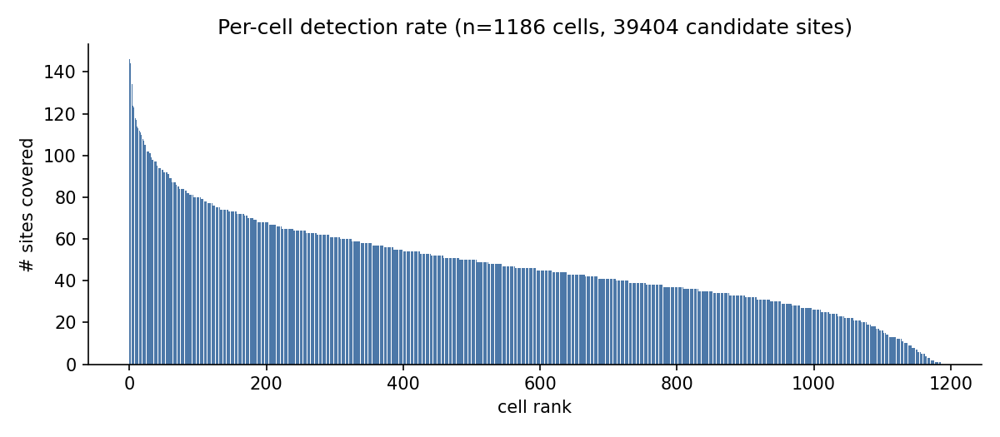
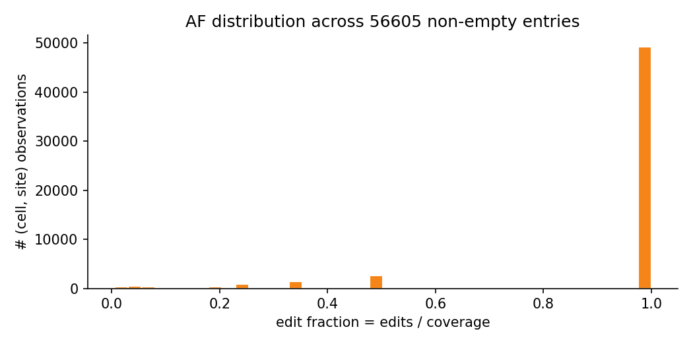
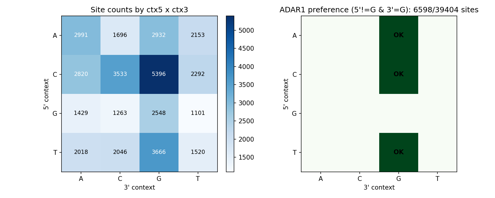
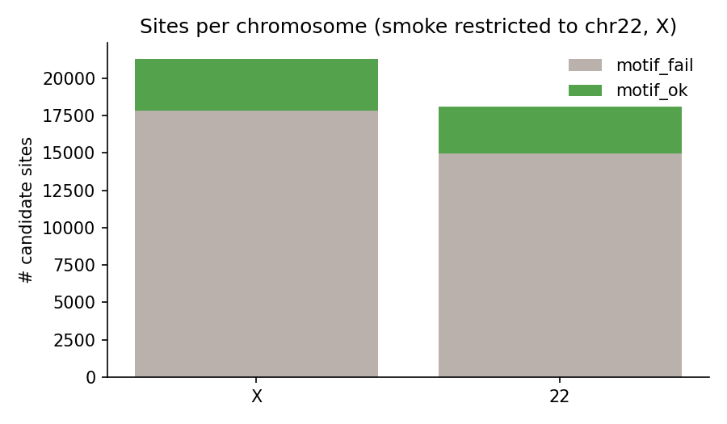
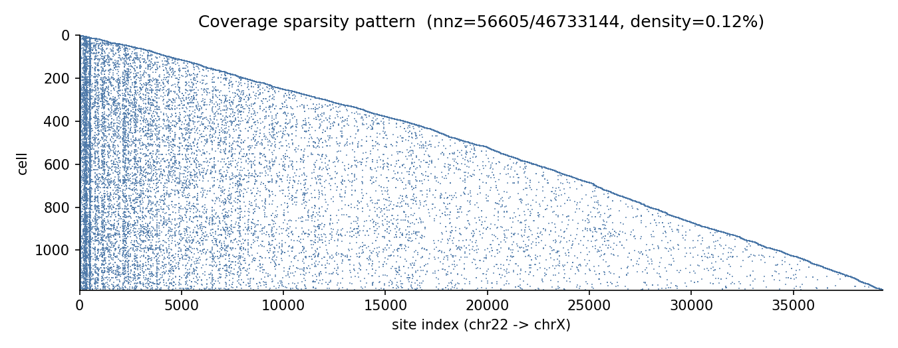
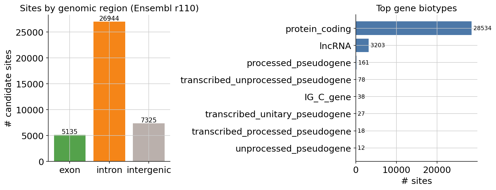
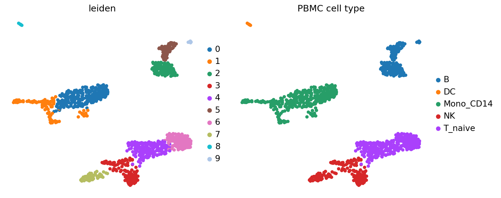
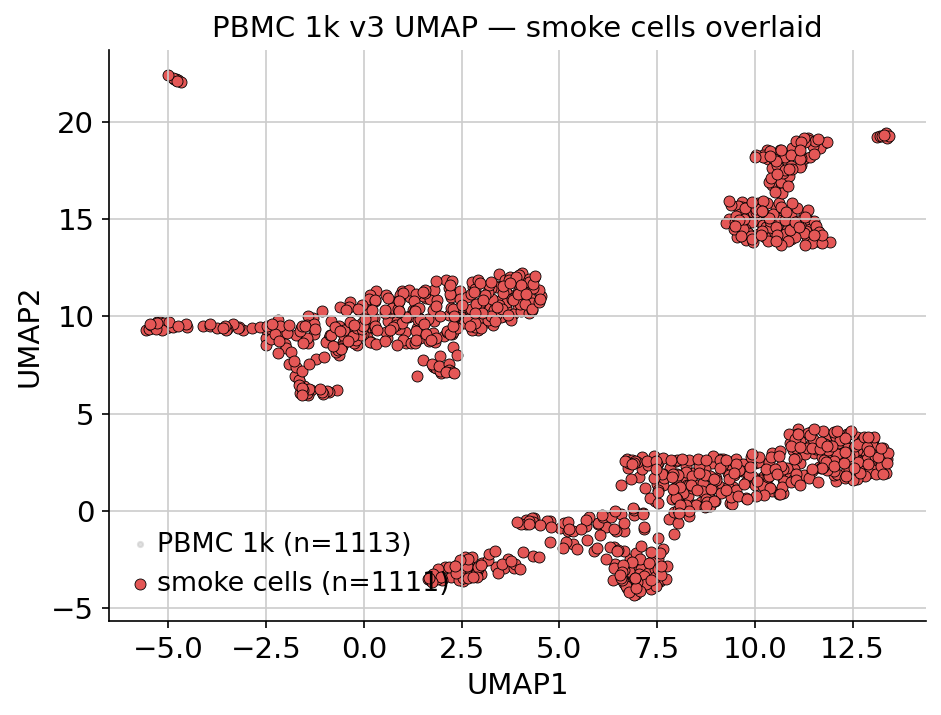
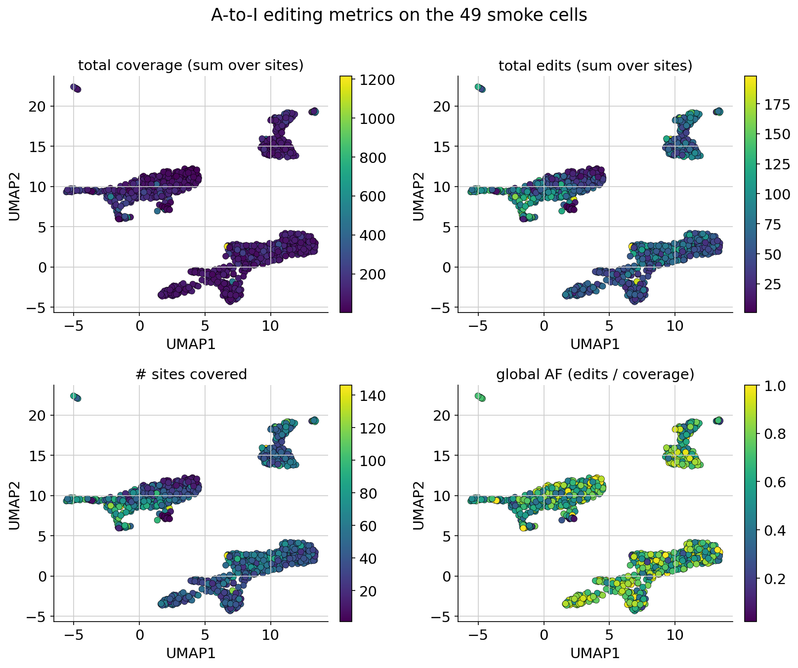
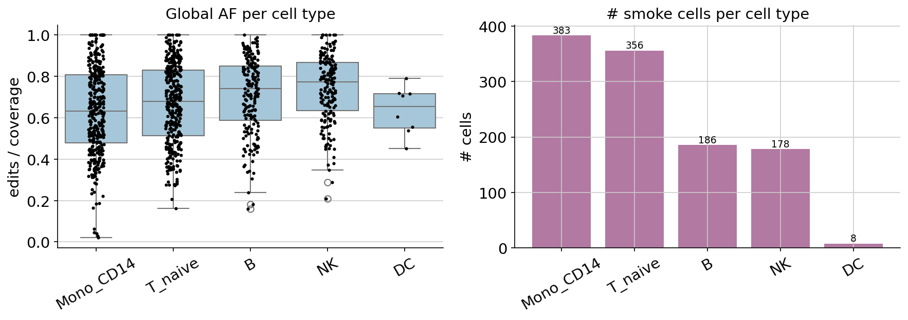

# PBMC 1k v3 Per-Cell Smoke Test

End-to-end validation of `sca2i-preprocess` on the 10x Genomics PBMC 1k v3
public demo with per-barcode 10x architecture (one obs row per cell, not
pseudobulk by celltype).

## Inputs

| Source | URL / Path |
|---|---|
| BAM | `https://cf.10xgenomics.com/samples/cell-exp/3.0.0/pbmc_1k_v3/pbmc_1k_v3_possorted_genome_bam.bam` (4.1 GB) |
| BAI | `https://cf.10xgenomics.com/samples/cell-exp/3.0.0/pbmc_1k_v3/pbmc_1k_v3_possorted_genome_bam.bam.bai` |
| Filtered barcodes | `pbmc_1k_v3_filtered_feature_bc_matrix.tar.gz` → `barcodes.tsv.gz` (1222 cells) |
| Genome FASTA | Ensembl `release-110` GRCh38 primary assembly (contigs without `chr` prefix — matches BAM) |
| RepeatMasker | UCSC `hg38.fa.out.gz` |
| REDItools2 | `git@1e9d396f8aba058f073d7d27bf1148fe408adaf8` (pinned) |

## Configuration deviations from production

These are smoke-only relaxations; revert before running production batches.

| Key | Smoke | Production |
|---|---|---|
| `reditools.min_coverage` | 3 | 20 (parent NN#3 lock) |
| `genome.chromosomes` | `["22", "X"]` | full autosomes + X (Y/MT excluded) |
| Cells per sample | full 1222 barcodes (filtered_feature_bc_matrix) | full barcode list |
| Cores | 1 (single-thread) | per-cluster (see `profiles/slurm`) |

## How to reproduce

```bash
git checkout validation/pbmc1k-percell

# 1) Stage BAM + barcodes manually into results/data/pbmc1k/
#    (the BAM is too large to host in-repo)
mkdir -p results/data/pbmc1k
# ... curl / scp the 4 files listed above ...
tar -xzf results/data/pbmc1k/pbmc_1k_v3_matrix.tar.gz \
    -C results/data/pbmc1k/

# 2) Generate samples.tsv + cells.tsv (full 1222 barcodes)
python tools/make_cells_tsv.py \
    --barcodes results/data/pbmc1k/filtered_feature_bc_matrix/barcodes.tsv.gz \
    --bam      results/data/pbmc1k/pbmc_1k_v3_bam.bam \
    --sample   pbmc1k --n-cells 100000 --seed 0

# 3) Pre-build conda envs
snakemake --use-conda --conda-create-envs-only --cores 1

# 4) Run. PYTHONNOUSERSITE avoids shadowing by ~/.local pandas.
PYTHONNOUSERSITE=1 snakemake --use-conda --cores 1 -p --keep-going
```

## Acceptance result

`results/anndata/sca2i_input.h5ad`:

| Metric | Value |
|---|---|
| shape (cells × sites) | **1186 × 39404** |
| X dtype, nnz | int32, 56605 |
| `layers["edits"]` dtype, nnz | int32, 56605 |
| `obs.columns` | `sample_id, chemistry, donor, cell_type, cell_barcode` |
| `var.columns` | `chrom, pos, strand, ref, alt, ctx5, ctx3, adar_motif_ok, in_alu` |
| Chromosomes seen | `22, X` |
| `adar_motif_ok=True` | 6598 / 39404 (16.7%) |
| `in_alu=True` | 29053 / 39404 (73.7%) — matches A-to-I/Alu enrichment literature |
| Wall time | ~33 min sinto split + ~5h10m downstream (single core) |
| Snakemake jobs | 13411 / 13411 |

36 cells of 1222 dropped: zero candidate edits passing `min_coverage=3` on
chr22 + chrX.

## Diagnostic plots

Generated with `tools/plot_smoke_results.py` from
`results/anndata/sca2i_input.h5ad`.

| Stat | Value |
|---|---|
| median sites/cell | 46 |
| max sites/cell    | 146 |
| min sites/cell    | 1 |
| mean AF           | 0.91 |
| median AF         | 1.00 |
| nonzero (cell, site) entries | 56605 |
| chr22 sites / chrX sites | 18108 / 21296 |
| `adar_motif_ok` sites | 6598 / 39404 (16.7%) |

### 1. Per-cell detection rate

Cells ranked by number of covered sites. Long tail across the 1186 cells
that survived the `min_coverage=3` filter; median 46, max 146.



### 2. Allele-fraction distribution

Per (cell, site) edit fraction `k / n`. The smoke profile keeps
`min_coverage=3`, so most entries land at AF=1 — each cell barely covers
each site, and any coverage with at least one G read is a "full" edit.
Production `min_coverage=20` will spread this out.



### 3. Motif context (ctx5 × ctx3)

Left: counts of candidate sites by 5′ and 3′ neighbouring base.
Right: ADAR1 preference mask (5′ ≠ G AND 3′ = G). 6598 / 39404 sites
(16.7%) match. This is annotation-only; we do not drop non-preferred
sites at the preprocess stage.



### 4. Sites per chromosome

Stacked by `adar_motif_ok`. chrX contributes ~18% more sites than chr22
(21296 vs 18108).



### 5. Sparsity pattern

Coverage matrix `X` (1186 cells × 39404 sites) is extremely sparse
(nnz=56605, density ≈ 0.12%). The two diagonal bands correspond to the
chr22 and chrX site ranges respectively.



## Single-cell context analysis

To connect the candidate edit sites back to standard scRNA-seq analysis we
(a) annotate each site against Ensembl r110 and (b) embed the full 1222-cell
PBMC matrix, overlay the 1186 cells that survived editing-side QC, and
look at per–cell-type editing.

The plots below are produced by `tools/annotate_sites_gtf.py` +
`tools/analyze_with_scanpy.py`, both runnable inside the
`sca2i-analyze` env (`workflow/envs/analyze.yaml` or
`docker/Dockerfile`).

### 6. Site annotation against Ensembl r110

| Bucket | Count |
|---|---|
| exon       | 5135  |
| intron     | 26944 |
| intergenic | 7325  |
| protein_coding host | 28534 |
| lncRNA host         | 3203  |

Top host genes (chr22+X): TNRC6B (1284), DIAPH2 (589), PPP6R2 (472),
TBC1D22A (441), STAG2 (413), TBL1X (333), GRK3 (322), MRTFA (309). Most
candidate sites land in introns of protein-coding genes — consistent
with the expected enrichment of A-to-I editing inside SINE/Alu repeats
embedded in introns.



### 7. UMAP — leiden clusters + PBMC cell types

Standard scanpy pipeline on the filtered 10x v3 matrix
(1222 cells → 1113 after `min_genes=200`, `pct_mt<20%`; 33538 genes →
2000 HVGs; PCA 30 → UMAP). Cell types assigned by scoring leiden clusters
against a compact PBMC marker panel (CD4/CD8 T, naive T, NK, B,
CD14 mono, FCGR3A mono, DC, platelet).



Cluster sizes: Mono_CD14=385, T_naive=356, B=186, NK=178, DC=8.

### 8. Editing cells overlaid on the full UMAP

The 1186 cells that survived editing-side QC (red) cover essentially the
entire PBMC UMAP. 1111/1186 also pass expression-side QC and land inside
a cluster; 75 are dropped by `min_genes=200` / `pct_mt<20%` and don't
show up.



### 9. Editing metrics painted on cells

For each cell we compute: total coverage (Σ `n` across sites), total
edits (Σ `k`), number of covered sites, and global AF = Σk/Σn.



### 10. Editing rate by cell type

Per-cell global AF, grouped by the leiden-inferred cell type, across the
1111 cells with both expression and editing data. With smoke
`min_coverage=3` most cells sit at AF≈1; production `min_coverage=20`
will spread this out. The cell-count panel on the right shows how
editing-side coverage distributes across the 5 PBMC populations.



## Reproducing the analysis plots

```bash
# Build the analysis env (one of two options)
conda env create -n sca2i-analyze -f workflow/envs/analyze.yaml
#   - or -
docker build -f docker/Dockerfile -t sca2i-analyze:latest .

# One-time: Ensembl GTF for chr22/X gene annotation
mkdir -p resources/gtf && curl -fsSL -o \
    resources/gtf/Homo_sapiens.GRCh38.110.gtf.gz \
    https://ftp.ensembl.org/pub/release-110/gtf/homo_sapiens/Homo_sapiens.GRCh38.110.gtf.gz

# Run
PYTHONNOUSERSITE=1 conda run -n sca2i-analyze python tools/annotate_sites_gtf.py
PYTHONNOUSERSITE=1 conda run -n sca2i-analyze python tools/analyze_with_scanpy.py
```

## Fixes captured on this branch

- **`from __future__ import annotations`** removed from all snakemake
  `script:` files — Snakemake 8/9 injects its preamble before the user
  script body, which makes `from __future__` no longer be the first
  statement and raises `SyntaxError`.
- **`workflow/envs/sinto.yaml`** pins `setuptools <80` — sinto imports
  `pkg_resources` at startup, which setuptools >=80 dropped.
- **REDItools2 install** switched from broken `pip install
  git+...` (the repo has no `setup.py`) to a new
  `clone_reditools2` rule that clones the pinned commit into
  `resources/reditools2/`; `reditools.smk` invokes the resulting
  `reditools.py` via `python`.
- **`split_bam_per_cell`** outputs a sentinel file
  (`results/prep/10x/{sample}/split/.sentinel`) instead of
  `directory(...)`, avoiding Snakemake 9's `ChildIOException` when
  downstream rules write `.bai` siblings into the same directory.
- **Per-cell 10x architecture**: `common.groups_for_sample()` now returns
  unique `cell_barcode` values; `prep_groups.py` writes bc→bc rows so
  sinto emits one BAM per cell. `cells.tsv` carries one obs row per cell.

## Fixes captured on this branch (continued)

- **`make_alu_bed`** column filter corrected: was `$11 ~ /^Alu/` which
  never matched (RepeatMasker `.out` puts the family name in column 10
  and the class string `SINE/Alu` in column 11). Now `$11 == "SINE/Alu"`,
  which captures every Alu subfamily. `resources/alu/alu.bed` goes from 0
  to 1,238,995 intervals; `in_alu=True` on this run is 29053 / 39404
  (73.7%), consistent with the A-to-I editing literature.

## Runtime env requirement

Set `PYTHONNOUSERSITE=1` when invoking snakemake on this machine — there
is a partially-broken `~/.local/lib/python3.12/site-packages/pandas` that
will shadow conda env pandas (missing `pytz`) and break every Python rule.
Consider adding to the user's shell profile, or document in `profiles/`.
